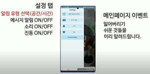
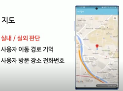
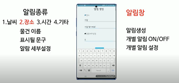
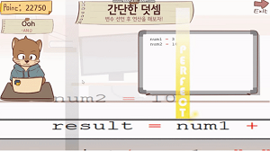
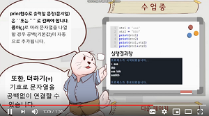
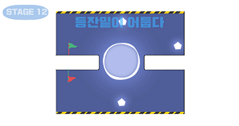

# 활동내용[아맞다! 알림어플]
 * 프로젝트 설명 : 사용자가 깜빡 놓고 간 물건을 상기시켜주는 알림  
      1) 일정 시간 이후 작동되는 푸쉬알림기능  
      2) 실내 -> 실외로 이동시 작동되는 푸쉬 알림 기능  
      3) 사용자의 이동 경로 추적 및 GPS기능  
      4) 기후 맞춤형 추천 팝업 기능 
 * 수상경력 : **2019 스타트업 해커톤 (19.09.28) 최우수상 수상** 
 * 팀명 : 데브그루 (경북대학교 코딩동아리 해달 소속)
 * 팀원 : 김성록(대표), 윤치호(개발), 이준병(개발),  이준기(기획), 장우진(디자인)
 * 게임 실행 영상
 
  Video Label
 * 게임 관련사진
 
 

# 활동내용[팀 리듬코딩]
 * 프로젝트 설명 : 리듬게임과 코딩을 합쳐 재밌게 코딩을 공부할 수 있는 게임. (PC)  
 **(19.11.20) 최우수상 수상** 
 * 팀명 : 팀 리듬코딩
 * 팀원 : 윤치호(메인코딩), 장우진(서브코딩,디자인), 박지환(기획)
 * 게임 실행 영상
 
  Video Label
 * 게임 관련사진
 
 
 
 
# 활동내용[업사이드다운]

 * 프로젝트 설명 : 중력을 바꾸어가며 stage 클리어하는 플랫폼 게임 (Android)
 * 팀원 : 윤치호, 장우진(캐릭터 디자인)
 * 게임 실행 영상(https://www.youtube.com/watch?v=NZiZURiTpno)
 * 게임 다운로드 링크(https://play.google.com/store/apps/details?id=com.CHHO.UPSIDEDOWN)
 * 관련사진.
 
 
 
